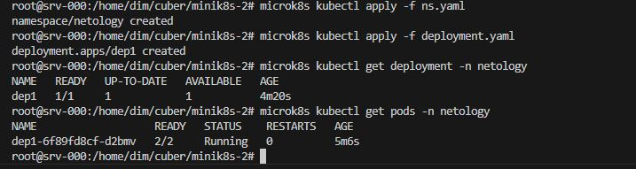
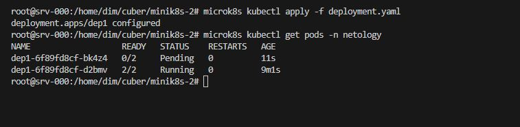
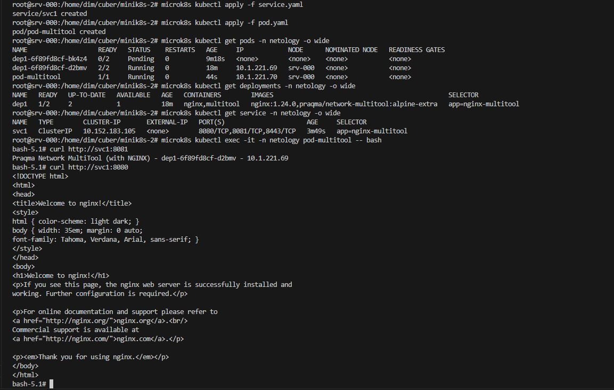

# Домашнее задание к занятию «Запуск приложений в K8S»


### Цель задания

В тестовой среде для работы с Kubernetes, установленной в предыдущем ДЗ, необходимо развернуть Deployment с приложением, состоящим из нескольких контейнеров, и масштабировать его.

------

### Чеклист готовности к домашнему заданию

1. Установленное k8s-решение (например, MicroK8S).
2. Установленный локальный kubectl.
3. Редактор YAML-файлов с подключённым git-репозиторием.

------

### Инструменты и дополнительные материалы, которые пригодятся для выполнения задания

1. [Описание](https://kubernetes.io/docs/concepts/workloads/controllers/deployment/) Deployment и примеры манифестов.
2. [Описание](https://kubernetes.io/docs/concepts/workloads/pods/init-containers/) Init-контейнеров.
3. [Описание](https://github.com/wbitt/Network-MultiTool) Multitool.

------

### Задание 1. Создать Deployment и обеспечить доступ к репликам приложения из другого Pod

1. Создать Deployment приложения, состоящего из двух контейнеров — nginx и multitool. Решить возникшую ошибку.
2. После запуска увеличить количество реплик работающего приложения до 2.
3. Продемонстрировать количество подов до и после масштабирования.
4. Создать Service, который обеспечит доступ до реплик приложений из п.1.
5. Создать отдельный Pod с приложением multitool и убедиться с помощью `curl`, что из пода есть доступ до приложений из п.1.

**Ответ.**
для начала создадим namespase netoligy

[ns.yaml](ns.yaml)
    

    ```yaml
    ---
    apiVersion: v1
    kind: Namespace
    metadata:
    name: netology
    namespace: netology
    ...
    ```

1. [deployment.yaml](deployment.yaml)

    <details><summary>deployment.yaml</summary>

    ```yaml
    ---
    apiVersion: apps/v1
    kind: Deployment
    metadata:
    name: dep1
    labels:
        task: one
        tier: homework
    annotations:
        container1: nginx
        container2: multitools
    namespace: netology
    spec:
    replicas: 1
    strategy:
        rollingUpdate:
        maxSurge: 1
        maxUnavailable: 1
        type: RollingUpdate
    selector:
        matchLabels:
        app: nginx-multitool
    template:
        metadata:
        labels:
            app: nginx-multitool
        spec:
        containers:
            - name: nginx
            image: nginx:1.24.0
            resources:
                limits:
                memory: "128Mi"
                cpu: "500m"
                requests:
                memory: "64Mi"
                cpu: "250m"
            ports:
                - name: web
                containerPort: 80
            livenessProbe:
                tcpSocket:
                port: 80
                initialDelaySeconds: 10
                timeoutSeconds: 3
            readinessProbe:
                httpGet:
                path: /
                port: 80
                initialDelaySeconds: 15
                timeoutSeconds: 5
                successThreshold: 1
                failureThreshold: 4
            - name: multitool
            image: praqma/network-multitool:alpine-extra
            resources:
                limits:
                memory: "128Mi"
                cpu: "450m"
                requests:
                memory: "32Mi"
                cpu: "150m"
            env:
                - name: HTTP_PORT
                value: "1181"
                - name: HTTPS_PORT
                value: "1443"
            ports:
                - name: http
                containerPort: 1181
                protocol: TCP
                - name: https
                containerPort: 1443
                protocol: TCP
            livenessProbe:
                tcpSocket:
                port: 1181
                initialDelaySeconds: 10
                timeoutSeconds: 3
            readinessProbe:
                httpGet:
                path: /
                port: 1181
                initialDelaySeconds: 15
                timeoutSeconds: 5
                successThreshold: 1
                failureThreshold: 2
    ...
    ```

    </details>


3. одна реплика
 
 

теперь меняем количество реплик на 2 и запускаем

 

4. [service.yaml](service.yaml)

    <details><summary>service.yaml</summary>

    ```yaml
    ---
    apiVersion: v1
    kind: Service
    metadata:
    name: svc1
    namespace: netology
    spec:
    selector:
        app: nginx-multitool
    type: ClusterIP
    ports:
        - name: nginx
        port: 8080
        targetPort: 80
        - name: multitool-http
        port: 8081
        targetPort: 1181
        - name: multitool-https
        port: 8443
        targetPort: 14433
    ...
    ```

    </details>

5. [pod.yaml](pod.yaml)

    <details><summary>pod.yaml</summary>

    ```yaml
    ---
    apiVersion: v1
    kind: Pod
    metadata:
    name: pod-multitool
    labels:
        app: multitool
        comment: testig-app
        company: netology
        stage: study
    namespace: netology
    spec:
    containers:
        - name: multitool
        image: praqma/network-multitool:alpine-extra
        resources:
            limits:
            memory: "128Mi"
            cpu: "600m"
            requests:
            memory: "32Mi"
            cpu: "100m"
        ports:
            - name: "http"
            containerPort: 8082
            - name: "https"
            containerPort: 8444
    ...
    ```

    </details>

    
------

### Задание 2. Создать Deployment и обеспечить старт основного контейнера при выполнении условий

1. Создать Deployment приложения nginx и обеспечить старт контейнера только после того, как будет запущен сервис этого приложения.
2. Убедиться, что nginx не стартует. В качестве Init-контейнера взять busybox.
3. Создать и запустить Service. Убедиться, что Init запустился.
4. Продемонстрировать состояние пода до и после запуска сервиса.

**Ответ.**

Создадим новое пространство имен

[ns2.yaml](ns2.yaml)
    

    ```yaml
    ---
    apiVersion: v1
    kind: Namespace
    metadata:
    name: netology-2
    namespace: netology-2
    ...
    ```


1. [deployment2.yaml](deployment2.yaml)

    <details><summary>deployment2.yaml</summary>

    ```yaml
    ---
    apiVersion: apps/v1
    kind: Deployment
    metadata:
    name: dep2
    labels:
        task: two
        tier: homework
    annotations:
        container: nginx
        container-init: busybox
    namespace: netology-2
    spec:
    replicas: 1
    strategy:
        rollingUpdate:
        maxSurge: 1
        maxUnavailable: 1
        type: RollingUpdate
    selector:
        matchLabels:
        app: nginx-init
    template:
        metadata:
        labels:
            app: nginx-init
        spec:
        containers:
            - name: nginx
            image: nginx:1.24.0
            resources:
                limits:
                memory: "128Mi"
                cpu: "500m"
                requests:
                memory: "64Mi"
                cpu: "250m"
            ports:
                - name: web
                containerPort: 80
            livenessProbe:
                tcpSocket:
                port: 80
                initialDelaySeconds: 10
                timeoutSeconds: 3
            readinessProbe:
                httpGet:
                path: /
                port: 80
                initialDelaySeconds: 15
                timeoutSeconds: 5
                successThreshold: 1
                failureThreshold: 4
        initContainers:
            - name: busybox
            image: busybox:1.36.1
            resources:
                limits:
                memory: "64Mi"
                cpu: "250m"
                requests:
                memory: "8Mi"
                cpu: "50m"
            env:
                - name: TARGET
                value: "svc2"
            command: ['sh', '-c', "until nslookup $TARGET.$(cat /var/run/secrets/kubernetes.io/serviceaccount/namespace).svc.cluster.local; do sleep 2; done"]
    ...
    ```

    </details>

2. *check*
3. [service2.yaml](service2.yaml)

    <details><summary>service2.yaml</summary>

    ```yaml
    ---
    apiVersion: v1
    kind: Service
    metadata:
    name: svc2
    namespace: netology-2
    spec:
    selector:
        app: nginx-init
    type: ClusterIP
    ports:
        - name: nginx
        port: 8888
        targetPort: 80
    ...
    ```

    </details>


4. 

------

### Правила приема работы

1. Домашняя работа оформляется в своем Git-репозитории в файле README.md. Выполненное домашнее задание пришлите ссылкой на .md-файл в вашем репозитории.
2. Файл README.md должен содержать скриншоты вывода необходимых команд `kubectl` и скриншоты результатов.
3. Репозиторий должен содержать файлы манифестов и ссылки на них в файле README.md.

------
